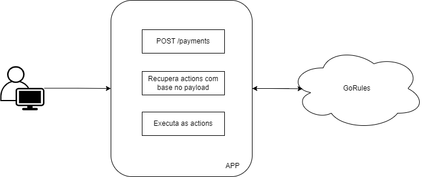

# Desafio BHub

[](https://sonarcloud.io/summary/new_code?id=edumerckx_desafio-bhub)
[](https://sonarcloud.io/summary/new_code?id=edumerckx_desafio-bhub)

Aplicação referente ao desafio proposto pela BHub. O objetivo é ter um mecanismo capaz de processar diferentes regras com base no seu payload.

## Instalação
Para instalação das dependências é necessário o uso do [poetry](https://python-poetry.org/) (ferramenta para gestão de dependências). Caso ainda não possua essa ferramenta instalada, usar o comando abaixo:
```shell
pip install poetry
```

Com o poetry instalado, executar o comando abaixo na raiz do projeto:
```shell
poetry install
```

E para ativar o _virtualenv_, executar:
```shell
poetry shell
```

Antes de *startar* a aplicação é necessário configurar as variáveis de ambiente conforme o arquivo [.env-example](https://github.com/edumerckx/desafio-bhub/blob/main/.env-example). Depois dessa configuração é só executar o comando abaixo para *rodar* a aplicação.
```shell
task dev
```


## Como funciona?

Pensando na simplicidade e para uma versão inicial, a aplicação é basicamente um monolito que recebe uma requisição, consome um serviço externo ([GoRules](https://gorules.io/)) que contém as definições de regras e finaliza o processamento com base nas actions cadastradas. Aqui todo o processo é síncrono.



## Uso

Para testar o mecanismo de avaliação de regras e execução das ações pode ser o usada a [collection postman](https://github.com/edumerckx/desafio-bhub/blob/main/postman_collection.json) ou executar os comandos cUrl abaixo:

```shell
# emitirRemessaEntrega
curl --location 'localhost:5000/payments' \
    --header 'Content-Type: application/json' \
    --data '{
        "payment": {
            "type": "fisico"
        }
    }'
```

```shell
# ativaAssociacao
curl --location 'localhost:5000/payments' \
    --header 'Content-Type: application/json' \
    --data '{
        "record_type": "activate"
    }'
```

```shell
# atualizaAssociacao
curl --location 'localhost:5000/payments' \
    --header 'Content-Type: application/json' \
    --data '{
        "record_type": "update"
    }'
```
